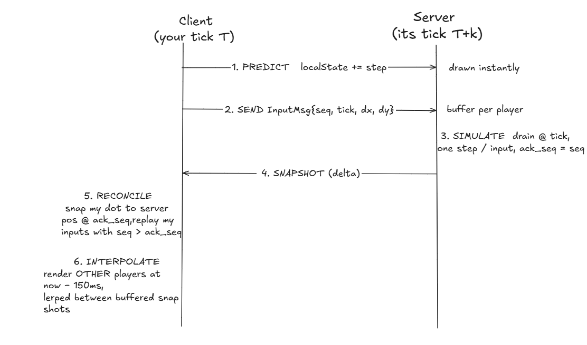

# Architecture

Gonet is a multi-player real-time game built with Go.
The game is two circles in an arena; the game comes with serious netcode so it
feels instant and fair despite lag, jitter, and divergence. This document is the
map: the concurrency model, the wire protocol, and the six-stage pipeline a
single keypress travels through.

## Topology


A `cmd/bot` client and the `cmd/loadtest` harness connect over the *same*
WebSocket protocol as the browser.

## Concurrency model: one owner, channels at the edges

All game state lives in a single goroutine (`hub.Run`). Nothing else touches it.

- **Per connection:** one goroutine blocks on `conn.ReadMessage()`, decodes an
  `InputMsg`, and hands it to the hub over the `input` channel. It never mutates
  state.
- **The hub goroutine** owns the `clients` map, the tick counter, history, and
  every player's position. It `select`s over `register`, `unregister`, `input`,
  `lobby`, and the 50 ms `ticker`. Because it's the only writer, **there are no
  mutexes on game state** — the channel hand-off is the synchronization.
- **Reads from outside** (the `GET /lobby` HTTP handler) round-trip a request
  through the hub over a channel and get a snapshot back, so even read access
  never races.

This is the Go "share memory by communicating" pattern: serialize all state
access through one goroutine instead of locking shared structures.

## Fixed-timestep tick loop

The simulation advances on a `time.NewTicker(50ms)` — **20 ticks per second** —
independent of how fast inputs or connections arrive. Each tick:

1. respawn anyone whose 3s countdown elapsed,
2. drain each player's input buffer and apply one movement step per input,
3. resolve collisions,
4. snapshot positions into the history ring (for lag compensation),
5. build and send a per-client delta,
6. log `tick_id / players / snapshot_bytes / tick_ms` (sampled at ~1 Hz).

A fixed delta keeps physics **deterministic** — the same inputs always produce
the same positions — which is the precondition for client-side prediction and
reconciliation to agree with the server.

## Wire protocol

MessagePack (binary) over WebSocket. Two messages, plus a one-time welcome.

| Direction | Message | Fields |
|---|---|---|
| client → server | `InputMsg` | `dx, dy` (−1/0/1) · `seq` (monotonic) · `tick` (last server tick seen) |
| server → client | snapshot delta | `tick_id` · `players: [changed fields only]` · `removed: [ids]` |
| server → client | welcome (on connect) | `{ you: <your id> }` |

**Deltas, not full state.** The server keeps the last snapshot it sent *each*
client and transmits only fields that changed since. Idle players vanish from
the wire; the client merges each delta onto a persistent world map. The welcome
message tells a client which entity is *itself*, so it can predict and reconcile
that one.

## Whole keypress pipeline



### 1 · Predict (client)
Pressing a key applies the move to a local copy (`localState`) **immediately**,
running the same physics the server will. No round-trip, so your own dot is
zero-latency. This is what cancels ping.

### 2 · Send (client)
The same input goes to the server stamped with a monotonic `seq` and the last
server `tick` you'd seen (used later for lag compensation). `seq` starts at 1 so
the server's initial `ack_seq` of 0 unambiguously means "nothing acked yet."

### 3 · Simulate (server, authoritative)
Inputs land in a 64-slot ring buffer per player. At tick time the hub drains the
buffer and applies **one movement step per input**, clamped to the arena. The
highest `seq` it consumed becomes that player's `ack_seq`. The server is the
single source of truth; the client's prediction is only a guess until confirmed.

### 4 · Snapshot (server → client)
After stepping, the hub computes each client's delta against what it last sent
them and broadcasts it. `ack_seq` rides along so the client knows how far the
server has caught up.

### 5 · Reconcile (client)
On each snapshot the client **snaps** its own dot to the authoritative position
(which reflects inputs up to `ack_seq`), then **replays every still-unacked
input** (`seq > ack_seq`) on top. With identical deterministic physics this
reproduces the predicted position exactly when the prediction was right, and
silently corrects it when it wasn't — no rubber-banding. The HUD's `corr` shows
the magnitude of each correction (≈0 in steady state).

### 6 · Interpolate (client, remote players)
You can't predict opponents — you don't know their inputs. Instead the client
buffers timestamped position samples and renders remote players at
**now − 150 ms**, lerping between the two samples bracketing that time. The
150 ms cushion absorbs jitter; snapshots arriving unevenly still produce smooth
motion. If render time runs past the newest sample (a gap), it dead-reckons from
the last velocity, capped. The trade is deliberate: you see opponents slightly
in the past so they always move smoothly.

> **The split is about information, not delay:** you *predict* what you control
> (you know your inputs) and *interpolate* what you don't (you only know past
> positions). Prediction fights latency; interpolation fights jitter.

## Lag compensation

A relentless charge that connected on *your* laggy screen should still land. The
hub keeps a 30-frame ring of past positions (1.5 s). When resolving a collision,
the attacker is whoever charges harder along the line between the two; the victim
is **rewound** to where the attacker saw it (`attacker.lastView − interpTicks`)
for the hit test. So the fairness is judged against what the acting player
actually saw, the way an FPS confirms shots server-side.

## Game mechanics

Overlapping circles transfer radius from the player charging in less to the one
charging in more (closing-speed along the contact line). Shrink to the lose
radius and you're out: the opponent scores, you vanish for 3 s, then respawn at
a random spot at full size. All authoritative — the client renders radius/score
from snapshots and predicts only its own *position*.

## The bot — just another client

`cmd/bot` connects over the same WebSocket and speaks the same `InputMsg`/
snapshot protocol; the server can't distinguish it from a human. It plays via a
behavior-cloning MLP or a chase heuristic:

```
RECORD=games.jsonl go run ./cmd/server   # log (state, action) pairs while you play
python scripts/train_bot.py games.jsonl bot_model.json   # fit a 4→16→2 numpy MLP
go run ./cmd/bot -model bot_model.json   # the bot reads snapshots, runs a
                                         # forward pass, sends InputMsg
```

Features are deliberately **positional** (dx/dy to opponent + both radii, no own
velocity) — feeding velocity back in makes the clone copy momentum and stick to
walls. The key insight: behavior cloning imitates the demonstrator, so the bot
approaches "plays like you" but can't exceed you; beating that ceiling needs
self-play RL.

## Scaling and known limits

Measured with `cmd/loadtest` (N concurrent headless clients in one arena):

| Load | tick time | notes |
|---|---|---|
| 40 clients | 2–4 ms | ~12× under the 50 ms budget |
| 150 clients | 23–45 ms | at the budget knee |

The bottleneck is **O(n²)**: in a single shared arena, both collision resolution
and per-client delta encoding scale with players². The architecture's answer is
sharding into 2-player **rooms** — each room is O(1) per session, so the server
scales to thousands of independent games. The single-arena numbers are a
deliberate worst case. `pprof` (localhost:6060) confirms goroutines return to
baseline after load — no leak.

## Repository layout

```
cmd/server     main.go — wires the hub, HTTP routes, embedded static files
cmd/bot        headless WebSocket player (MLP or heuristic)
cmd/loadtest   concurrent-client load harness
internal/hub   tick loop, physics, collisions, lag comp, delta encoding
client/        the game UI (prediction, reconciliation, interpolation, Canvas)
site/          the landing page (served at /, game at /play)
scripts/       train_bot.py — behavior-cloning trainer
```
