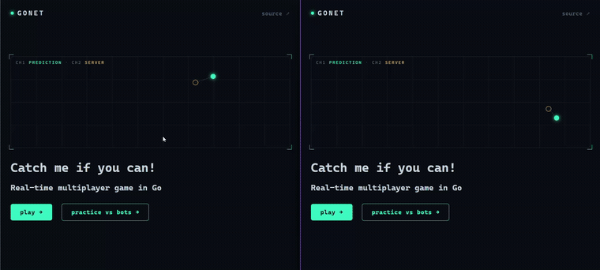

# GONET

**Real-time multiplayer netcode-inspired game in Go** — client-side prediction, server
reconciliation, and entity interpolation that make milliseconds of lag *disappear*.
The game is two circles in an arena; built to solve network latency problems in online games.

[](https://gonet.onrender.com/)


<p align="center">
  

</p>

## Why it's interesting

The netcode *is* the project. Every technique that makes online games feel
instant — despite lag, jitter, and diverging state — is built from scratch and
visible live in the on-screen HUD:

- ⚡ **Client-side prediction** — your move applies instantly; no round-trip wait.
- 🎯 **Server reconciliation** — the authoritative server corrects mispredictions
  *invisibly* (no rubber-banding, even at 500 ms of lag).
- 🌊 **Entity interpolation** — opponents glide smoothly between 20 Hz snapshots.
- 🎬 **Lag compensation** — hits are judged against what the attacker actually saw.
- 📦 **Binary delta protocol** — MessagePack snapshots, ~½ the bytes of full state.
- 🔒 **Fixed-timestep authoritative server** — deterministic 20 Hz simulation; a
  single goroutine owns all state, so there are **no mutexes**.
- 🤖 **A behavior-cloning AI opponent** — a tiny MLP trained on human play,
  connecting as an ordinary WebSocket client. Practice against a live bot lobby.

Load-tested with a custom harness to its **O(n²) failure point** (~150 concurrent
clients) and profiled with `pprof` — zero goroutine leaks.

## Tech stack

`Go` · `gorilla/websocket` · `MessagePack` · `vanilla JS + Canvas` ·
`Python / numpy` (bot training) · `Docker` · `Render`

## Play

Use arrow keys or WASD to move your circle. Charge into your opponent to drain them. 

- **Live:** **[gonet.onrender.com](https://gonet.onrender.com/)**
- **Local:**
  ```bash
  go run ./cmd/server     # http://localhost:8080
  ```
  Then `/play` (open two tabs to play yourself) or `/play?mode=practice` (a
  server-populated bot lobby).

## How it works

The full design — the six-stage pipeline a keypress travels, the single-owner
concurrency model, the wire protocol, lag compensation, the AI bot, benchmarks,
and how to run/verify everything — lives in **[ARCHITECTURE.md](ARCHITECTURE.md)**.

## Repo layout

```
cmd/server     wires the hubs, HTTP routes, embedded assets
cmd/bot        headless WebSocket bot (MLP or heuristic)
cmd/loadtest   concurrent-client load harness
internal/hub   tick loop, physics, collisions, lag comp, delta encoding
internal/bot   the bot's decision logic
client/        the game UI (prediction · reconciliation · interpolation)
site/          the landing page
scripts/       train_bot.py — behavior-cloning trainer
```

## What's next

**Rooms** (2-player sharding → O(1) per session → thousands of concurrent games)
and **self-play RL bots** (to beat the behavior-cloning ceiling). Details in
[ARCHITECTURE.md](ARCHITECTURE.md).

---

[play it live →](https://gonet.onrender.com/)
